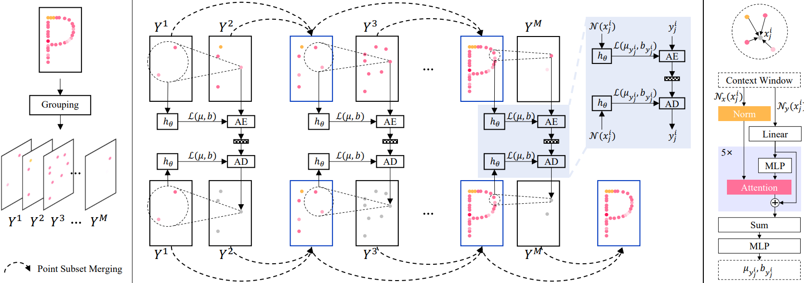
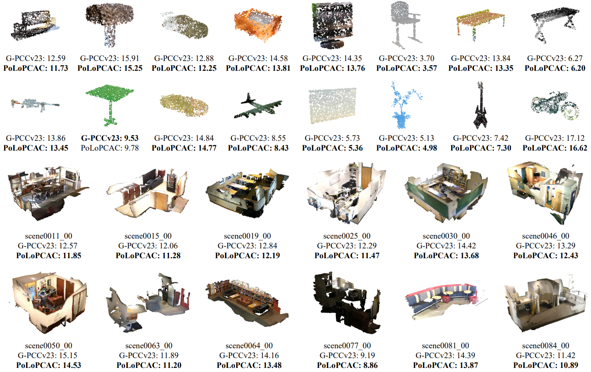
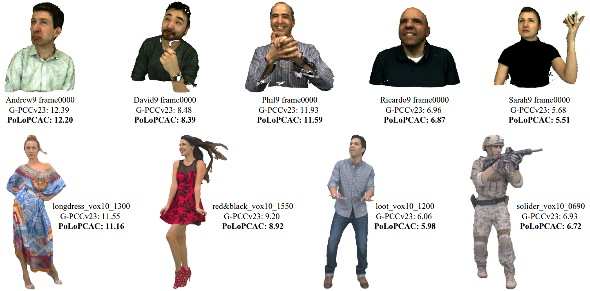
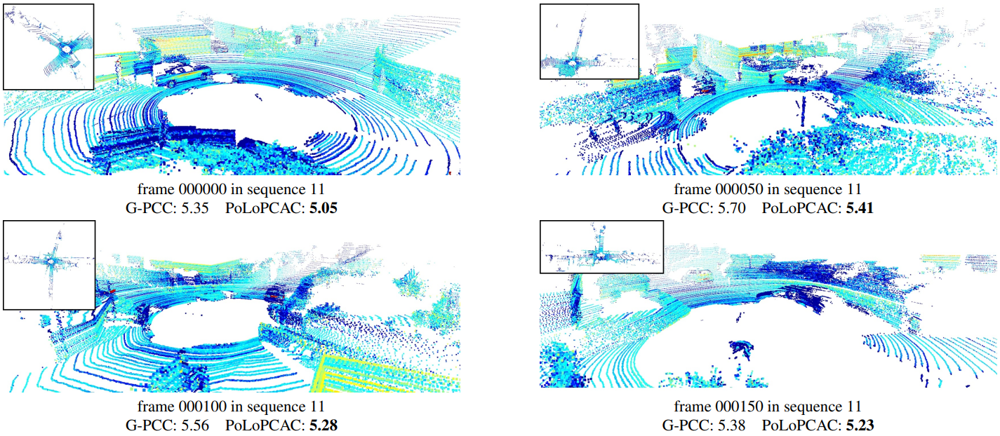

# Efficient and Generic Point Model for Lossless Point Cloud Attribute Compression

[](https://arxiv.org/abs/XXXXXX)
[](https://github.com/i2-multimedia-lab/polopcac/issues?q=is%3Aopen+is%3Aissue)
[](https://github.com/i2-multimedia-lab/polopcac/issues?q=is%3Aissue+is%3Aclosed) 
[](https://choosealicense.com/licenses/mit/)

🔥  **High Performance**: Lower bitrate than G-PCCv23 predlift. \
🚀 **High Efficiency**: Faster than G-PCCv23 on one RTX 2080Ti. \
🌌 **Robust Generalizability**: Instantly applied to various samples once trained on a small-scale objects.  \
🌍 **Scale&Density Independent**: Directly executed on point clouds of arbitrary scale and density. \
🌱 **Light Weight**: Only 676k parameters (about 2.6MB).

## Abstract

> The past several years have witnessed the emergence of learned point cloud compression (PCC) techniques. However, current learning-based lossless point cloud attribute compression (PCAC) methods either suffer from high computational complexity or deteriorated compression performance. Moreover, the significant variations in point cloud scale and sparsity encountered in real-world applications make developing an all-in-one neural model a challenging task. In this paper, we propose PoLoPCAC, an efficient and generic lossless PCAC method that achieves high compression efficiency and strong generalizability simultaneously. We formulate lossless PCAC as the task of inferring explicit distributions of attributes from group-wise autoregressive priors. A progressive random grouping strategy is first devised to efficiently resolve the point cloud into groups, and then the attributes of each group are modeled sequentially from accumulated antecedents. A locality-aware attention mechanism is utilized to exploit prior knowledge from context windows in parallel. Since our method directly operates on points, it can naturally avoids distortion caused by voxelization, and can be executed on point clouds with arbitrary scale and density. Experiments show that our method can be instantly deployed once trained on a Synthetic 2k-ShapeNet dataset while enjoying continuous bit-rate reduction over the latest G-PCCv23 on various datasets (ShapeNet, ScanNet, MVUB, 8iVFB). Meanwhile, our method reports shorter coding time than G-PCCv23 on the majority of sequences with a lightweight model size (2.6MB), which is highly attractive for practical applications.

## Overview



## Environment

The environment we use is as follows：

- Python 3.10.10
- Pytorch 2.0.0 with CUDA 11.7
- Pytorch3d 0.7.3
- Torchac 0.9.3

For the convenience of reproduction, we provide three different ways to help create the environment:

#### Option 1: Using yml

```
conda env create -f=environment.yml
```

#### Option 2: Using .sh

```
source ./env_create.sh
```

#### Option 3: CodeWithGPU (AutoDL image)

Docker image in [CodeWithGPU](https://www.codewithgpu.com/image) will be released soon.

## Data

Example point clouds are saved in ``./data/`` with the following format:

```
data/
    ├── ScanNet/    // A ScanNet point cloud on original scale
    ├── ScanNet_10bit/      // Rescale the point cloud to the scale of [0, 1023] (but not voxelized)
    ├── ScanNet_12bit/      // Rescale the point cloud to the scale of [0, 4095] (but not voxelized)
    |
    ├── SemanticKITTI/      // A SemanticKITTI point cloud with reflectance attribute on original scale
    ├── SemanticKITTI_10bit/      // Rescale the point cloud to the scale of [0, 1023] (but not voxelized)
    ├── SemanticKITTI_12bit/      // Rescale the point cloud to the scale of [0, 4095] (but not voxelized)
    |
    └── ShapeNet_10bit/     // Several sparse object point clouds (2k points per object) on the scale of [0, 1023] (not voxelized)
```

The Synthetic 2k-ShapeNet dataset used in the paper is uploaded to [Google Drive](https://drive.google.com/file/d/1mhUBx4_6joG0KxPkHfXol8fw0tSHxvq6/view?usp=sharing).

## Training

📢 Synthetic 2k-ShapeNet trained model is saved in ``./model/``.

Otherwise you can train the model from from scratch:

```
python ./train.py \
    --training_data='./data/Synthetic_2k_ShapeNet/train_64/*.ply' \
    --model_save_folder='./retrained_model/'
```

(The PoLoPCAC might perform better when trained on non-voxelized samples, such as Synthetic 2k-ShapeNet)

## Compression

```
python ./compress.py \
    --ckpt='./model/ckpt.pt' \
    --input_glob='./data/ScanNet/*.ply' \
    --compressed_path='./data/ScanNet_compressed'
```

💡 You are expected to get the same Bpp value for one point cloud of different scale (e.g., same Bpp result for ``/data/ScanNet/scene0011_00_vh_clean_2.ply``, ``/data/ScanNet_10bit/scene0011_00_vh_clean_2.ply``, and ``/data/ScanNet_12bit/scene0011_00_vh_clean_2.ply``).

## Decompression

```
python ./decompress.py  --ckpt='./model/ckpt.pt' \
    --compressed_path='./data/ScanNet_compressed' \
    --decompressed_path='./data/ScanNet_decompressed'
```

## Compression For Reflectance

```
python ./reflectance_compress.py \
    --ckpt='./model/ckpt.pt' \
    --input_glob='./data/SemanticKITTI/*.ply' \
    --compressed_path='./data/SemanticKITTI_compressed'
```

## Decompression For Reflectance

```
python ./reflectance_decompress.py \
    --ckpt='./model/ckpt.pt' \
    --compressed_path='./data/SemanticKITTI_compressed' \
    --decompressed_path='./data/SemanticKITTI_decompressed'
```

## Examples

### Objects&Scenes



### Human Bodies



### LiDAR Reflectance



## Citation

😊 If you find this work useful, please consider citing our work:

```
@article{kang2024polopcac,
      title={Efficient and Generic Point Model for Lossless Point Cloud Attribute Compression}, 
      author={Kang You, Pan Gao, Zhan Ma},
      journal={arXiv preprint arXiv:XXXXX},
      year={2024}
}
```
